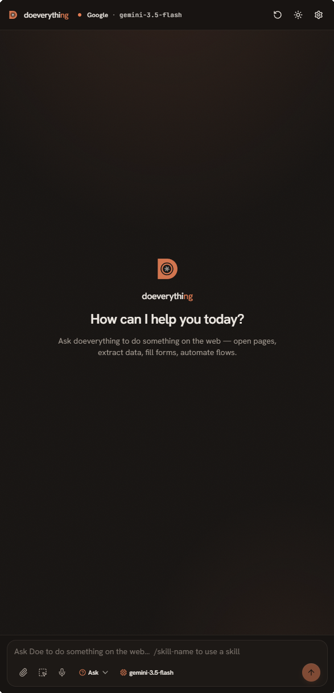

<p align="center">
  
</p>

# doeverything

> Your browser, on autopilot. doeverything is a Chrome extension that turns any LLM into a browser agent — chat in the side panel, it navigates, fills forms, and runs tools on your behalf.


**[Install from the Chrome Web Store →](https://chromewebstore.google.com/detail/caeifdbplgjpcjogmjabiacdbhdhehie)**

<p align="center">
  
</p>

## What it does

- **Chat-driven browser automation** — talk to doeverything in the side panel; it plans and executes multi-step tasks across tabs.
- **Provider-agnostic** — built on the [Vercel AI SDK](https://sdk.vercel.ai). Pick Anthropic, OpenAI, Google, Groq, Mistral, xAI, Cerebras, Together, OpenRouter, or any OpenAI-compatible endpoint.
- **MCP relay** — expose all browser tools to any MCP client (claude.ai, Claude Desktop, Cursor, VS Code, ChatGPT, and more) via the relay at [relay.doeverythi.ng](https://relay.doeverythi.ng). stdio clients use `@doeverything/mcp-bridge`.
- **25+ browser tools** — navigate, click, type, screenshot, network sniff, JS execute, GIF record, scheduled tasks, and more.
- **Skills system** — reusable markdown prompts with frontmatter, slash-command activation, URL matchers.
- **Scheduled tasks** — schedule any prompt to run once, daily, weekly, monthly, or every N minutes; the agent opens a window, executes hands-off, retries on failure, and sends a desktop notification with the result.
- **Actions** — save prompts as named slash-command shortcuts (`/research`, `/summarize`) with optional starting URLs; launch them from the composer or wire them to a recurring schedule.
- **Persistent memory** — the agent writes facts it discovers (CSS selectors, preferences, tracking IDs) to a per-domain store that survives restarts; browse, edit, import, and export memory from the Options page.
- **Workflow recording** — capture agent runs as annotated GIFs with per-action screenshots, then download or drag-drop them into any file input for sharing or replay.
- **Run history** — every agent execution is logged with token usage, first-token latency, tool calls, and outcome; expand any conversation to see a full breakdown or export an HTML transcript.

## Usage

There are three ways to use doeverything. Pick the one that fits your setup:

| | Option 1 — Side panel | Option 2 — Relay URL | Option 3 — mcp-bridge |
|---|---|---|---|
| **Best for** | Direct use in the browser | Web clients (claude.ai, ChatGPT, …) | Desktop clients (Claude Code, Cursor, VS Code, Zed, …) |
| **How it works** | Chat in the side panel; doeverything runs its own agent loop | Extension → cloud relay → your AI client | Extension → local bridge process → your AI client |
| **Requires** | An API key from any supported provider | Any MCP-capable web client | Any MCP-capable desktop client |
| **Full feature set** | ✅ Chat, memory, scheduling, recording, actions, skills | Browser tools only (model runs in your client) | Browser tools only (model runs in your client) |

---

### Option 1 — Side panel with API key (recommended)

The self-contained mode. doeverything runs its own agent loop — no external client needed.

1. Install the extension from the [Chrome Web Store](https://chromewebstore.google.com/detail/caeifdbplgjpcjogmjabiacdbhdhehie) and open the side panel.
2. Go to **Options → LLM**, pick a provider (Anthropic, OpenAI, Google, Groq, …), and paste your API key.
3. Start chatting. The agent navigates, clicks, fills forms, and runs tasks on your behalf.

This mode gives you access to all features: persistent memory, scheduled tasks, workflow recording, saved actions, skills, and run history.

---

### Option 2 — Relay URL (web-based MCP clients)

Connect claude.ai, ChatGPT, or any other web client to your browser via the cloud relay.

1. Install the extension from the [Chrome Web Store](https://chromewebstore.google.com/detail/caeifdbplgjpcjogmjabiacdbhdhehie), open the side panel, and go to **Options → Connection → Generate MCP server URL**. The extension shows a personal URL like `https://relay.doeverythi.ng/mcp/abc123…`.
2. Paste that URL into your AI client's MCP connector settings. The **Connection** tab has step-by-step guides for each supported client.

---

### Option 3 — mcp-bridge (desktop MCP clients)

Desktop clients communicate over stdio and need a small local adapter that bridges them to the extension.

**Step 1 — Add to your client's MCP config:**

```json
{
  "mcpServers": {
    "doeverything": {
      "command": "npx",
      "args": ["-y", "@doeverything/mcp-bridge"]
    }
  }
}
```

For Claude Code specifically:
```bash
claude mcp add doeverything npx -- -y @doeverything/mcp-bridge
```

**Step 2 — Point the extension at the bridge:**

Open **Options → Connection → Relay base URL** → type `http://localhost:49463` → click **Save**.

The extension reconnects automatically — no rebuild required.

> **Note:** The first time you start the client, the extension may briefly show a connection error. This is normal — `npx` takes a few seconds to launch the bridge and the extension retries automatically.

---

### Using Doe via MCP (Options 2 & 3)

Once connected, mention **Doe** in your message to trigger browser actions from inside your AI client:

```
You:     Doe, open my GitHub notifications and summarize the unread ones.
Claude:  Sure — navigating to github.com/notifications now…
         [uses navigate, screenshot, and read tools]
         You have 4 unread notifications: …

You:     Doe, go to the pricing page on example.com and fill in the contact form.
Claude:  On it. I can see the form — filling in your details…
```

Your AI assistant automatically picks the right browser tool for each step. You don't need to specify which tool to use; just describe what you want done.

## Contributing

Issues and PRs are welcome. Here's how to get the project running locally.

**Requirements:** Node.js ≥ 22.14, pnpm 10

```bash
git clone https://github.com/tufanYavas/doeverything
cd doeverything
pnpm install
pnpm dev
```

`pnpm dev` builds all packages in watch mode and outputs the unpacked extension to `dist/`.

**Load the extension in Chrome:**

1. Go to `chrome://extensions`
2. Enable **Developer mode**
3. Click **Load unpacked** → select the `dist/` folder
4. After code changes, click the reload icon on the extension card (no need to re-run `pnpm dev`)

**Other commands:**

```bash
pnpm build          # production build
pnpm test           # run tests (Vitest)
pnpm type-check     # TypeScript check across all packages
pnpm lint           # ESLint
pnpm zip            # production build + zip for Chrome Web Store
```

**Project layout:** `chrome-extension/` is the service worker and manifest, `pages/` holds the React apps (side-panel, options, …), `packages/` holds shared libraries.

## License

MIT
